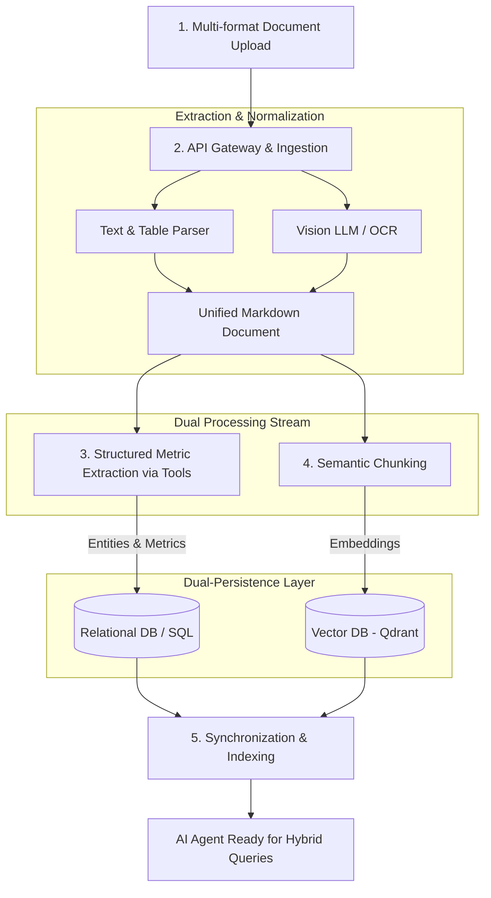

# AegisData AI - Dynamic Data Ingestion & Analytics for Social Impact

AegisData AI is an enterprise-grade SaaS platform built to help social workers, analysts, and public policy managers extract insights from unstructured social vulnerability data.

## 🌟 Key Features

- **Multi-Format Dynamic Ingestion:** Seamlessly ingests PDFs, Word documents, Excel spreadsheets, scanned images, and raw text.
- **Dual-Persistence Architecture:** Separates narrative context (Vector DB) from quantitative metrics (SQL) for high-precision querying.
- **Agentic RAG:** Humanized chat interface capable of cross-referencing multi-family data, generating structured reports, and running analytical queries.
- **Strict Data Privacy:** Built with privacy-first principles to handle sensitive social data securely.

## 🏗 System Architecture

The core pipeline processes unstructured inputs through a multi-stage normalization and extraction process:


##  🛠 Tech Stack
**Framework**: LangChain

**Vector Database**: Qdrant

**Relational Database**: PostgreSQL / SQLite (POC)

**Data Schema Validation**: Pydantic

**Execution Engine**: Node.js


📚 Documentation
Ingestion Architecture Details

ADR 0001: Hybrid Storage Approach

Privacy & Compliance Standards

## Suggested Folder Structure (Modular / Clean Architecture)

```bash
src/
├── app/                        # Roteamento Nativo do Next.js (App Router)
│   ├── (dashboard)/            # Rotas de interface visual (Chat, Ingestão, Relatórios)
│   ├── api/                    # Route Handlers (Endpoints de API)
│   │   ├── ingest/
│   │   │   └── route.ts        # Ponto de entrada HTTP para ingestão de arquivos
│   │   └── chat/
│   │       └── route.ts        # Ponto de entrada HTTP para o Agente RAG (Streaming)
│   ├── layout.tsx
│   └── page.tsx
│
├── modules/                    # Domínios de Negócio (Desacoplados da Web/Framework)
│   ├── ingestion/
│   │   ├── services/           # Parsers (PDF, Word), Chunking, Normalização
│   │   ├── use-cases/          # Orquestração do fluxo de ingestão
│   │   ├── interfaces/         # Contratos de parsers e loaders
│   │   └── dto/                # Schemas Zod de validação de input
│   │
│   ├── storage/
│   │   ├── repositories/       # Interfaces e implementações (PostgreSQL/Prisma e Qdrant)
│   │   └── schemas/            # Schemas Zod das famílias/entidades
│   │
│   └── agent/
│       ├── tools/              # Ferramentas do LangChain (SQL, Vector Search)
│       ├── services/           # Orquestração da memória e LLM
│       └── prompts/            # Templates e instruções do sistema
│
├── shared/                     # Código utilitário reutilizável
│   ├── components/             # Componentes React de UI (Tailwind, Shadcn)
│   ├── config/                 # Variáveis de ambiente e constantes
│   ├── errors/                 # Erros customizados da aplicação
│   └── types/                  # Tipos utilitários globais
```
