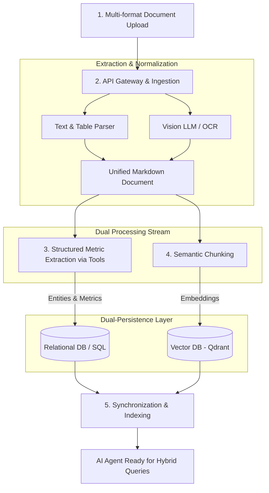

# AegisData AI - Dynamic Data Ingestion & Analytics for Social Impact

AegisData AI is an enterprise-grade SaaS platform built to help social workers, analysts, and public policy managers extract insights from unstructured social vulnerability data.

## 🌟 Key Features

- **Multi-Format Dynamic Ingestion:** Seamlessly ingests PDFs, Word documents, Excel spreadsheets, scanned images, and raw text.
- **Dual-Persistence Architecture:** Separates narrative context (Vector DB) from quantitative metrics (SQL) for high-precision querying.
- **Agentic RAG:** Humanized chat interface capable of cross-referencing multi-family data, generating structured reports, and running analytical queries.
- **Strict Data Privacy:** Built with privacy-first principles to handle sensitive social data securely.

## 🏗 System Architecture

The core pipeline processes unstructured inputs through a multi-stage normalization and extraction process:


##  🛠 Tech Stack
**Framework**: LangChain

**Vector Database**: Qdrant

**Relational Database**: PostgreSQL / SQLite (POC)

**Data Schema Validation**: Pydantic

**Execution Engine**: Node.js


📚 Documentation
Ingestion Architecture Details

ADR 0001: Hybrid Storage Approach

Privacy & Compliance Standards

## Suggested Folder Structure (Modular / Clean Architecture)

```bash
src/
├── modules/
│   ├── ingestion/             # Domínio de Ingestão de Documentos
│   │   ├── controllers/       # Endpoints HTTP
│   │   ├── services/          # Casos de uso (Parser, Chunking)
│   │   ├── interfaces/        # Contratos de parsers e loaders
│   │   └── dto/               # Validações de entrada
│   ├── storage/               # Domínio de Persistência
│   │   ├── repositories/      # Interfaces e implementações (SQL e Qdrant)
│   │   └── schemas/           # Pydantic-like/Zod schemas para o SQL
│   └── agent/                 # Domínio do Agente de IA / RAG
│       ├── tools/             # Ferramentas do LangChain
│       ├── services/          # Orquestração do RAG e LLM
│       └── controllers/       # Endpoint de Chat
├── shared/                    # Utilitários, Mappers e Tipos Globais
└── main.ts                    # Bootstrap da aplicação NestJS
```
